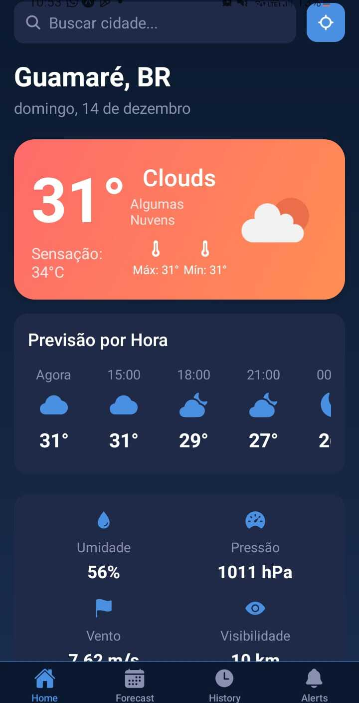

# Weather Forecast App

Aplicativo móvel de **previsão do tempo** desenvolvido com **React Native (Expo)** e **TypeScript**, com foco em desempenho, interface moderna e boa experiência do usuário. O aplicativo fornece dados climáticos em tempo real, previsões detalhadas e recursos como histórico de consultas e alertas personalizados.



---

## Principais Funcionalidades

* **Clima Atual**
  Exibe temperatura, sensação térmica, umidade, vento e visibilidade.

* **Previsão por Hora (24h)**
  Gráficos e listagem detalhada da variação de temperatura ao longo do dia.

* **Previsão de 7 Dias**
  Visão diária com temperaturas mínimas e máximas.

* **Histórico de Pesquisas**
  Armazena automaticamente as últimas localizações consultadas.

* **Alertas Climáticos**
  Permite configurar notificações para condições climáticas específicas (ex.: temperatura acima de um limite definido).

* **Localização Automática**
  Utiliza a localização do dispositivo para exibir previsões mais precisas.

---

## Tecnologias Utilizadas

* **React Native + Expo (SDK 49+)**
* **TypeScript**
* **Context API** para gerenciamento de estado
* **Axios** para consumo da API
* **Expo Location**
* **Expo Linear Gradient**
* **React Navigation (Bottom Tabs)**
* **React Native Chart Kit** para gráficos
* **Async Storage** para persistência local

---

## Instalação e Execução

### Pré-requisitos

* Node.js (versão LTS recomendada)
* npm ou yarn
* Expo Go (dispositivo físico ou emulador)

### Passos

 Baixe o repositório:

 Instale as dependências:

```bash
npm install
```

 Configure a API Key do OpenWeather (veja a seção abaixo).

 Inicie o servidor de desenvolvimento:

```bash
npx expo start
```

 Escaneie o QR Code com o Expo Go ou execute o projeto em um emulador.

---

## Configuração da API OpenWeather

Este aplicativo utiliza a **OpenWeather API** para obtenção dos dados climáticos.

### Obtenção da API Key

1. Crie uma conta em **OpenWeatherMap**.
2. Gere sua **API Key** no painel do usuário.
3. Aguarde a ativação da chave (o processo pode levar alguns minutos).

### Configuração no projeto

Abra o arquivo:

```ts
src/services/weatherService.ts
```

Substitua o valor da constante:

```ts
const API_KEY = 'SUA_CHAVE_API_AQUI';
```

> **Atenção**
> A **One Call API 2.5 foi descontinuada em junho de 2024**. Certifique-se de utilizar endpoints compatíveis com a versão e o plano ativos da OpenWeather API.

---

## Licença

Este projeto está licenciado sob a **MIT License**.
Consulte o arquivo `LICENSE` para mais detalhes.
